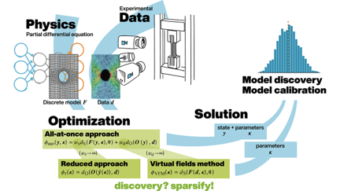

# Reduced and All-at-Once Approaches for Model Calibration and Discovery in Computational Solid Mechanics

This repository provides the research code and data employed for the calibration and discovery of constitutive models from full-field displacement data in the following publication:

[*"Reduced and All-at-Once Approaches for Model Calibration and Discovery in Computational Solid Mechanics"*](https://doi.org/10.1115/1.4066118)

<h1 align="center">

</h1><br>

## Citation
```
@article{roemer_modelCalibration_2024,
    title={Reduced and all-at-once approaches for model calibration and discovery in computational solid mechanics},
    author={Römer, Ulrich and Hartmann, Stefan and Tröger, Jendrik-Alexander and Anton, David and Wessels, Henning and Flaschel, Moritz and De Lorenzis, Laura},
    year={2024},
    journal={Applied Mechanics Reviews},
    volume={77},
    number={04},
    pages={040801},
    doi={https://doi.org/10.1115/1.4066118}
}
```

## Reproducing results

**The results in the publication can be reproduced using the provided research codes. Following calibration methods are covered:**
- Reduced approaches
    - NLS-FEM (nonlinear least-squares and finite elements)
    - Bayes-FEM (Bayesian inference and finite elements)
    - NLS-PINN (nonlinear least-squares and parametric physics-informed neural networks)
    - Bayes-PINN (Bayesian inference and parametric physics-informed neural networks)
- VFM (virtual fields method)
- All-at-once approaches
    - AAO-PINN (all-at-once using inverse physics-informed neural networks)
    - AAO-FEM (all-at-once using finite elements)
    - AAO-VFM (all-at-once virtual fields method)

> [!NOTE] 
> Results regarding model discovery can be reproduced with the research code and data provided in this [GitHub repository](https://github.com/EUCLID-code/EUCLID-hyperelasticity).

**The structure of this repository is as follows:**

Repository \
├── Experimental_Data \
├── Reduced \
&nbsp;&nbsp;&nbsp;&nbsp;├── FEM \
&nbsp;&nbsp;&nbsp;&nbsp;├── PINN \
&nbsp;&nbsp;&nbsp;&nbsp;├── NLS \
&nbsp;&nbsp;&nbsp;&nbsp;└── Bayes \
└── AAO \
&nbsp;&nbsp;&nbsp;&nbsp;├── PINN \
&nbsp;&nbsp;&nbsp;&nbsp;└── VFM_FEM 

> [!IMPORTANT]
> Installation instructions for the specific methods are given in the respective subdirectories.